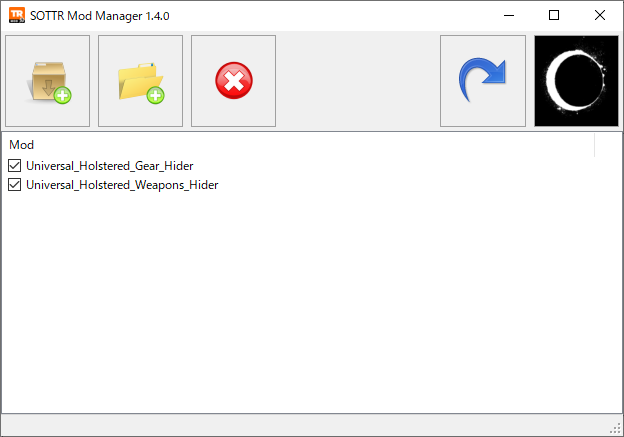
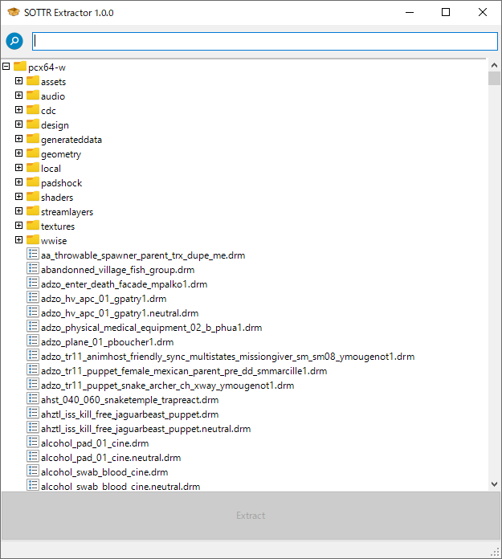

# SOTTR Mod Tools

This repository contains modding tools for Shadow of the Tomb Raider.

[Download](https://github.com/arcusmaximus/SottrModTools/releases)

[Documentation for modders](Documentation.md)

## Mod Manager

A standalone tool for installing/uninstalling mods. Temporarily disabling is also possible.

## Extractor

A standalone tool for extracting resources from the game.

## Blender addon

Can import meshes/skeletons/materials and export meshes.

## Binary templates

Template files for inspecting and modifying some file types with [ImHex](https://imhex.werwolv.net/) or [010 Editor](https://www.sweetscape.com/).
Can be used to tweak shader parameters in materials or bone positions in skeletons, for example.

# Credits
alphaZomega for their [file format descriptions](https://www.nexusmods.com/riseofthetombraider/mods/20) and Ekey for their open source [CDCE TIGER Tool](https://github.com/Ekey/CDCE.TIGER.Tool). A large part of the knowledge used to create these tools comes from there.

JOSTARMOD1 for the mod manager icon.
