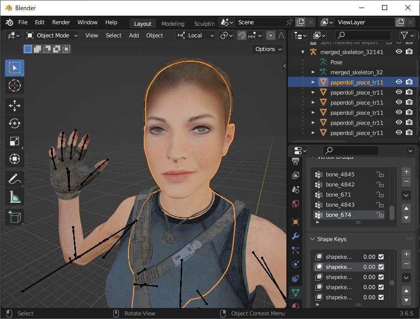

# SOTTR Mod Tools

This repository contains modding tools for Shadow of the Tomb Raider.

[Download](https://github.com/arcusmaximus/SottrModTools/releases)

## Mod Manager

A standalone tool for installing/uninstalling mods. Temporarily disabling is also possible.

## Extractor

A standalone tool for extracting resources from the game.

## io_scene_sottr

A Blender addon for importing meshes/skeletons/materials and exporting meshes.

# Credits
Ekey for their open source [CDCE TIGER Tool](https://github.com/Ekey/CDCE.TIGER.Tool). The majority of the knowledge used to create the manager and extractor comes from there.

Jostar for the mod manager icon.
